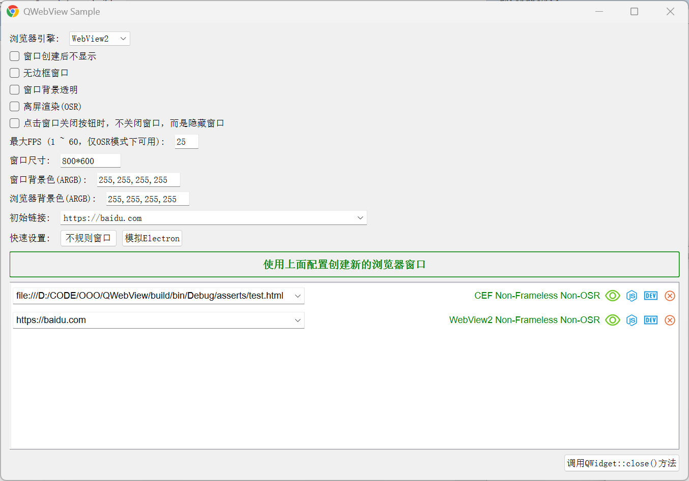

[简体中文|[English](README.md)]

<h1 align="center">QWebView</h1>

QWebView 提供了一个 Qt 小部件来显示网页并与网页交互，支持 CEF 和 Microsoft WebView2 浏览器内核。

## 统一接口

针对两种不同的浏览器内核，QWebView 提供了统一的接口，详见 [QWebView 类](./include/QWebView/Core.h)。

- 调用 CreateCEF 方法创建 CEF 内核的 QWebView 对象；

- 调用 CreateWebView2 方法创建 Microsoft WebView2 内核的 QWebView 对象；

## 非强依赖运行时

QWebView 对于 CEF 和 Microsoft WebView2 的运行时文件（如 libcef.dll 或 EmbeddedBrowserWebView.dll）不是强依赖的。

基于该特性，我们可以根据软件的实际运行环境来动态地切换浏览器内核，例如检测到用户系统上已安装 Microsoft WebView2 运行时，则软件使用 WebView2 内核，否则选择下载 CEF 运行时 或 Microsoft WebView2 运行时。

详见 [dynamic_engine](./samples/dynamic_engine) 示例。

## 全新的CEF集成方式

本仓库原名 QCefWidget（目前位于 [QCefWidget 分支](https://github.com/winsoft666/QCefWidget/tree/QCefWidget)），原项目仅支持 CEF 内核，而且在实现方式上采用全部自己实现 CEF 接口的方式，这种方式看似优雅，但工作量很大，而且灵活性欠佳，特别在适配不同 CEF 版本时，需要使用预编译宏做大量的判断和特殊处理。

无论 CEF 版本及接口如何更新，其官方示例永远都是可以正确运行的。

因此 QWebView 在 CEF 内核实现方面，采用了全新的方式，通过直接复用 cefclient 官方示例的代码，仅在其基础上做少量修改，既保证了功能的稳定性，也方便适配不同的 CEF 版本。

目前 QWebView 仅适配了 Windows 32位 74.1.19 版本的 CEF，如需支持其他 CEF（不限于操作系统、CEF版本），也不是难事，只需从 [CEF 官网](https://cef-builds.spotifycdn.com/index.html) 下载对应的 cefclient 示例代码，参考本项目中的修改方式进行修改即可。

> 在 dep\cef_binary_74.1.19+gb62bacf+chromium-74.0.3729.157_windows32 目录中搜索“winsoft666: [update-cefclient]” 即可查找所有修改。

## 丰富的示例

丰富的示例不仅是为了演示 QWebView 的使用方法，更是为了更好地测试自身的功能。

对于新手，建议从 single_cef 或 single_webview2 示例入手，而 comprehensive 示例则是一个综合性的示例，方便测试 QWebView 的所有功能。

## 注意事项

在使用 QWebView 的程序中，需要调用 [QApplication::setQuitOnLastWindowClosed](https://doc.qt.io/qt-5/qguiapplication.html#quitOnLastWindowClosed-prop) 方法设置当最后一个窗口关闭时，不自动退出 Qt 应用程序。取而代之的是通过 QWebViewManager::allWebViewsClosed 信号来判断是否需要退出应用程序。

对于 QWebView 的宿主窗口，不能设置 Qt::WA_DeleteOnClose 属性，而且对于 QWebView 的顶级宿主窗口，需要额外处理 QCloseEvent 事件，详见示例程序。
